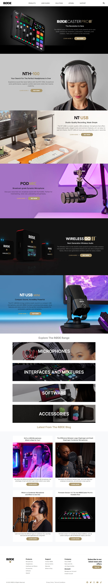

## PROJECT NAME: Rode Clone

### **💻TECH STACK USED IN THIS PROJECT:** 
- 
- 

### **🛠WHAT I HAVE LEARNT IN THIS PROJECT:** 
- I have learnt how to make websites responsive using tailwind CSS.

### **⌛TIME TAKEN TO COMPLETE THIS PROJECT:** 
- I have taken 7 hours to complete this project.

### **👀SCREEN CAPTURE IN LAPTOP SCREEN:**

### 📱💻📺This project is responsive on all screens between 390px to 1440px and above as well.

### **🚀LIVE LINK:**
-  This project is hosted on **Netlify**.You can Check it live using below link: 
-  [Project Live Link !](https://63254fdf41b1717d9b238e00--imaginative-ganache-d08ebc.netlify.app/)

        
        

